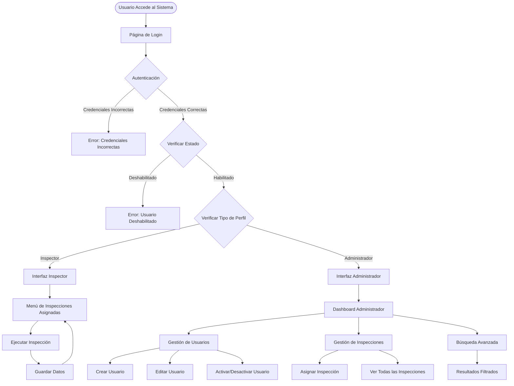
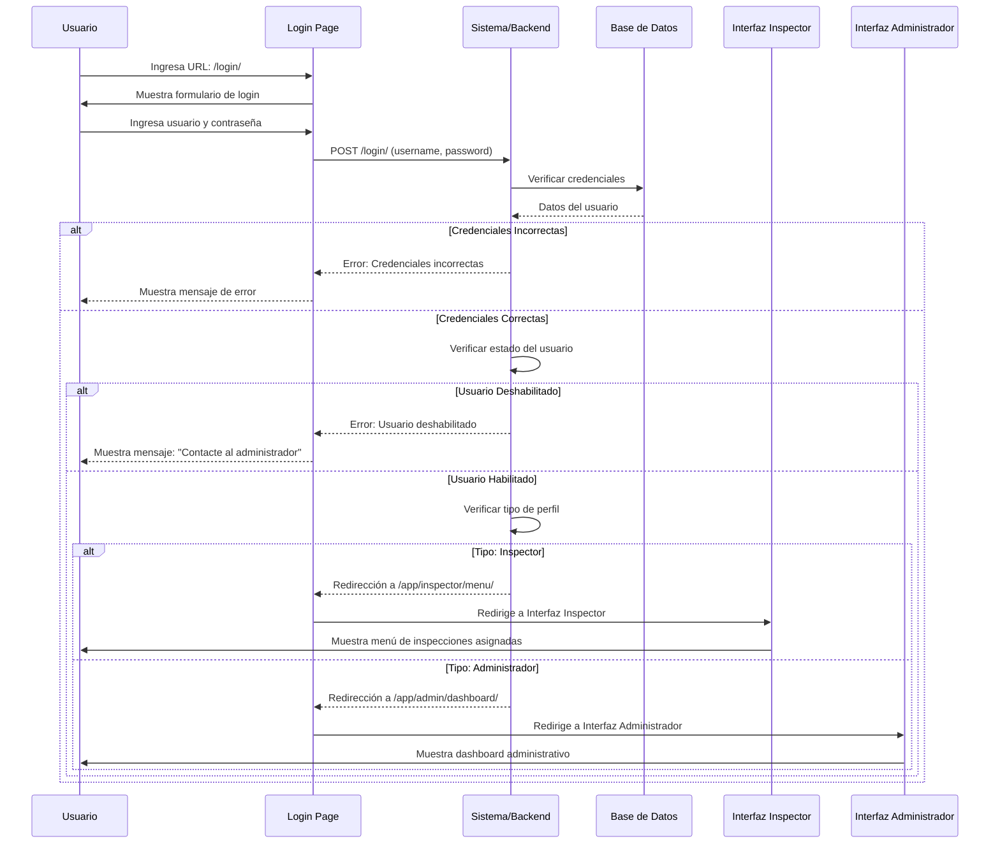
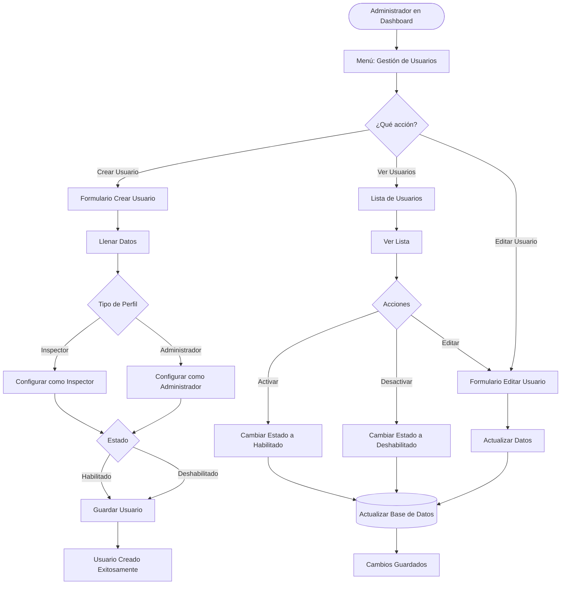
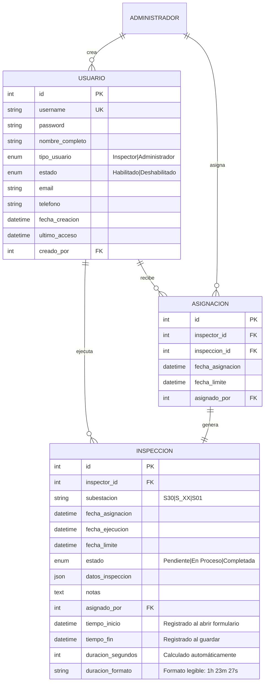
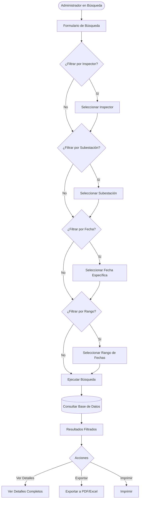
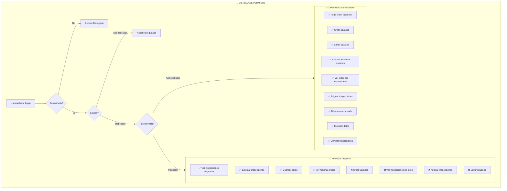
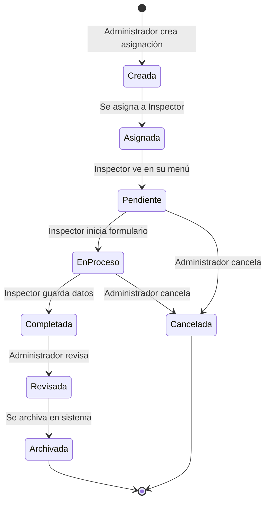
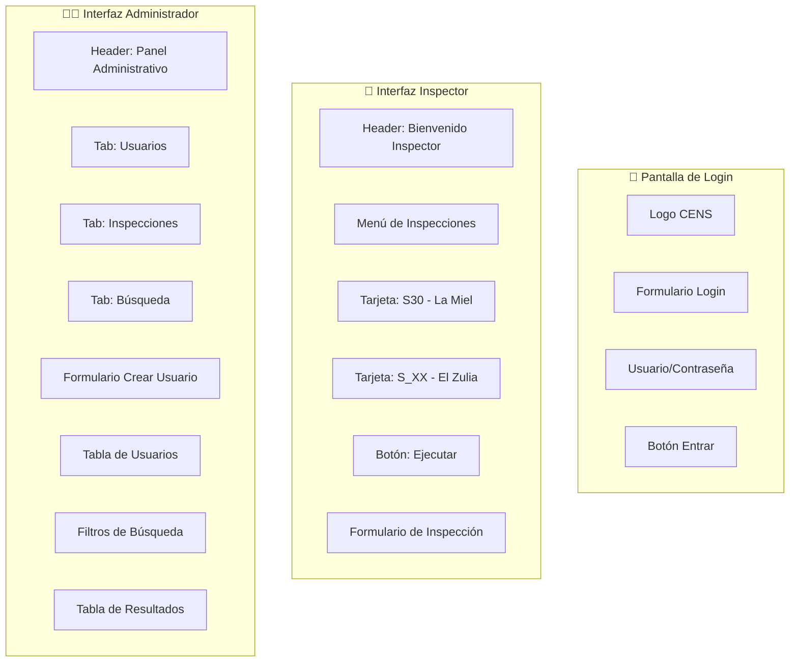

# Diagramas Completos del Sistema - Inspector y Administrador

## 📊 Diagrama 1: Arquitectura General del Sistema



---

## 🔄 Diagrama 2: Flujo Completo de Login y Redirección



---

## 👥 Diagrama 3: Gestión de Usuarios por Administrador



---

## 📋 Diagrama 4: Flujo Completo de Inspección

```mermaid
graph LR
    subgraph Admin["👨‍💼 Administrador"]
        A1[Admin Login] --> A2[Dashboard]
        A2 --> A3[Asignar Inspección]
        A3 --> A4[Seleccionar Inspector]
        A4 --> A5[Seleccionar Subestación]
        A5 --> A6[Definir Fecha Límite]
        A6 --> A7[Guardar Asignación]
        A7 --> DB1[(Base de Datos)]
    end
    
    subgraph Inspector["👤 Inspector"]
        I1[Inspector Login] --> I2[Menú Principal]
        I2 --> I3[Ver Inspecciones Asignadas]
        I3 --> I4[Seleccionar Inspección]
        I4 --> I5[Abrir Formulario]
        I5 --> I6[Llenar Datos]
        I6 --> I7[Guardar Inspección]
        I7 --> DB2[(Base de Datos)]
        I7 --> I8[Estado: Completada]
    end
    
    subgraph AdminView["👨‍💼 Administrador - Ver Resultados"]
        AV1[Ver Todas las Inspecciones] --> AV2[Aplicar Filtros]
        AV2 --> AV3{Búsqueda}
        AV3 -->|Por Inspector| F1[Filtrar por Inspector]
        AV3 -->|Por Fecha| F2[Filtrar por Fecha]
        AV3 -->|Por Subestación| F3[Filtrar por Subestación]
        AV3 -->|Por Rango| F4[Filtrar por Rango de Fechas]
        F1 --> AV4[Mostrar Resultados]
        F2 --> AV4
        F3 --> AV4
        F4 --> AV4
        AV4 --> AV5[Exportar/Ver Detalles]
    end
    
    DB1 --> I3
    DB2 --> AV1
```



---

## 🗄️ Diagrama 5: Estructura de Base de Datos



---

## 🔍 Diagrama 6: Sistema de Búsqueda Avanzada



---

## 🎯 Diagrama 7: Flujo Completo desde el Inicio

```mermaid
graph TB
    subgraph Inicio["🚀 INICIO DEL SISTEMA"]
        A[Usuario Accede] --> B[Página de Login]
        B --> C[Ingresa Credenciales]
    end
    
    subgraph Autenticacion["🔐 AUTENTICACIÓN"]
        C --> D{Verificar Credenciales}
        D -->|Incorrectas| E[Error: Credenciales Incorrectas]
        D -->|Correctas| F{Verificar Estado}
        F -->|Deshabilitado| G[Error: Usuario Deshabilitado]
        F -->|Habilitado| H{Verificar Tipo de Perfil}
    end
    
    subgraph InspectorFlow["👤 FLUJO INSPECTOR"]
        H -->|Inspector| I1[Redirige a /app/inspector/menu/]
        I1 --> I2[Ve Inspecciones Asignadas]
        I2 --> I3{¿Qué hacer?}
        I3 -->|Ejecutar| I4[Abrir Formulario]
        I3 -->|Ver Historial| I5[Ver Sus Inspecciones]
        I4 --> I5[⏱️ tiempo_inicio registrado]
        I5 --> I6[Llenar Datos]
        I6 --> I7[Guardar en Base de Datos]
        I7 --> I8[⏱️ tiempo_fin registrado]
        I8 --> I9[⏱️ duracion calculada]
        I9 --> I10[Estado: Completada]
        I10 --> I2
        Note right of I5: Inspector NO ve el tiempo
        Note right of I9: Solo Admin ve en registros
    end
    
    subgraph AdminFlow["👨‍💼 FLUJO ADMINISTRADOR"]
        H -->|Administrador| A1[Redirige a /app/admin/dashboard/]
        A1 --> A2{¿Qué hacer?}
        
        A2 -->|Gestión de Usuarios| A3[Gestión de Usuarios]
        A3 --> A4{Acción}
        A4 -->|Crear| A5[Crear Usuario]
        A4 -->|Editar| A6[Editar Usuario]
        A4 -->|Activar/Desactivar| A7[Cambiar Estado]
        A5 --> A8[Guardar en Base de Datos]
        A6 --> A8
        A7 --> A8
        
        A2 -->|Gestión de Inspecciones| A9[Gestión de Inspecciones]
        A9 --> A10{Acción}
        A10 -->|Asignar| A11[Asignar Inspección a Inspector]
        A10 -->|Ver Todas| A12[Ver Todas las Inspecciones]
        A11 --> A13[Guardar Asignación]
        A13 --> A8
        
        A2 -->|Búsqueda| A14[Búsqueda Avanzada]
        A14 --> A15[Aplicar Filtros]
        A15 --> A16[Mostrar Resultados]
        A16 --> A17{Acción}
        A17 -->|Ver| A18[Ver Detalles]
        A17 -->|Exportar| A19[Exportar Datos]
    end
    
    subgraph BaseDatos["💾 BASE DE DATOS"]
        I7 --> DB[(Base de Datos)]
        A8 --> DB
        A13 --> DB
        DB --> A12
        DB --> A16
    end
```

---

## 🔐 Diagrama 8: Sistema de Permisos y Seguridad



---

## 📱 Diagrama 9: Estructura de URLs y Navegación

```mermaid
graph TD
    Root[/] --> Login[/login/]
    
    Login -->|Inspector| InspectorRoutes
    Login -->|Administrador| AdminRoutes
    
    subgraph InspectorRoutes["👤 Rutas Inspector"]
        IR1[/app/inspector/menu/]
        IR2[/app/inspector/ejecutar/id/]
        IR3[/app/inspector/historial/]
        IR1 --> IR2
        IR1 --> IR3
    end
    
    subgraph AdminRoutes["👨‍💼 Rutas Administrador"]
        AR1[/app/admin/dashboard/]
        AR2[/app/admin/usuarios/]
        AR3[/app/admin/usuarios/crear/]
        AR4[/app/admin/usuarios/editar/id/]
        AR5[/app/admin/usuarios/activar/id/]
        AR6[/app/admin/inspecciones/]
        AR7[/app/admin/inspecciones/asignar/]
        AR8[/app/admin/buscar/]
        
        AR1 --> AR2
        AR1 --> AR6
        AR1 --> AR8
        AR2 --> AR3
        AR2 --> AR4
        AR2 --> AR5
        AR6 --> AR7
    end
```

---

## 🔄 Diagrama 10: Ciclo de Vida Completo de una Inspección



---

## 📊 Resumen Visual del Sistema

```
┌─────────────────────────────────────────────────────────────┐
│                    SISTEMA DE INSPECCIONES                   │
│                      CENS - Grupo EPM                        │
└─────────────────────────────────────────────────────────────┘
                              │
                              ▼
                    ┌─────────────────┐
                    │   LOGIN ÚNICO    │
                    │    /login/      │
                    └────────┬────────┘
                             │
                ┌────────────┴────────────┐
                │                        │
                ▼                        ▼
    ┌───────────────────┐    ┌──────────────────────┐
    │   INSPECTOR       │    │   ADMINISTRADOR      │
    │                   │    │                      │
    │ • Ver asignadas   │    │ • Crear usuarios     │
    │ • Ejecutar        │    │ • Activar/Desactivar │
    │ • Guardar datos   │    │ • Asignar inspecciones│
    │ • Ver historial   │    │ • Ver todas          │
    └───────────────────┘    │ • Búsqueda avanzada  │
                             │ • Exportar           │
                             └──────────────────────┘
                                      │
                                      ▼
                            ┌─────────────────┐
                            │  BASE DE DATOS  │
                            │                 │
                            │ • Usuarios      │
                            │ • Inspecciones  │
                            │ • Asignaciones  │
                            └─────────────────┘
```

---

## 🎨 Diagrama de Interfaz de Usuario



---

**Fecha de creación**: 12 de diciembre de 2025  
**Versión**: 1.0  
**Formato**: Diagramas Mermaid (compatibles con GitHub, GitLab, y editores Markdown)

---

## 📝 Notas sobre los Diagramas

- Todos los diagramas están en formato **Mermaid**
- Se pueden visualizar en:
  - GitHub/GitLab (automáticamente)
  - Editores como VS Code con extensión Mermaid
  - Herramientas online: https://mermaid.live/
- Los diagramas muestran el flujo completo del sistema desde el inicio
- Incluyen todas las funcionalidades: login, creación de usuarios, inspecciones, búsqueda, etc.

